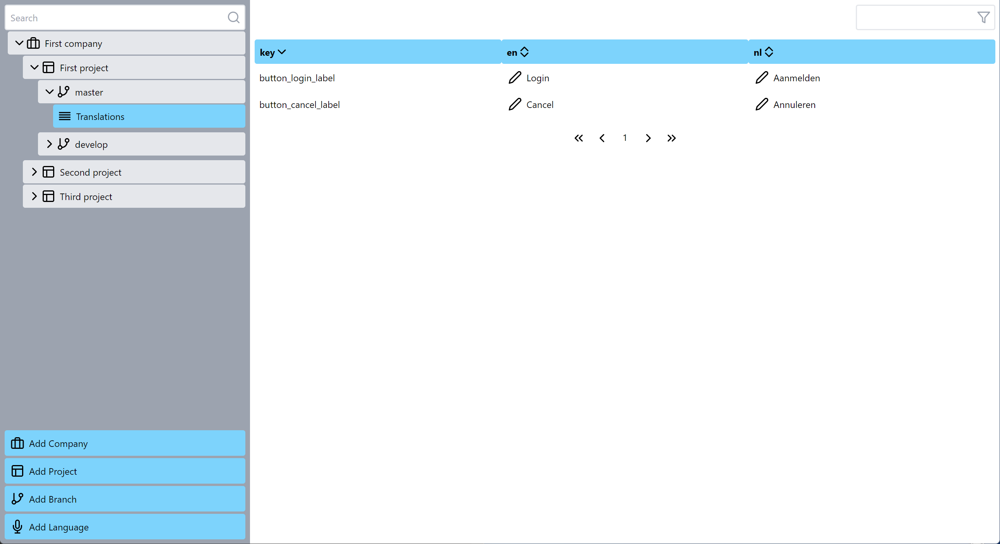

# Transl

OpenSource translation management website for intended for self-hosting

Currently, Work in progress

TODO:
* finish manipulations of the objects (delete, edit, ...)
* search for sidebar and translation views
* selectable displayed languages in translation view
* authentication
* demo link for github
* merge branch support
* automatic translations api supports (google, azure)



## Setup

* Install NodeJS 16+

* Install docker

* Start the docker instances and the frontend:
    ```
    npm run start
    ```

* The frontend should automatically open in your browser under
    ```
    http://localhost:3000
    ```

## Development

* More info on the frontend: [frontend readme](/frontend/README.md)
* More info on the database: [database readme](/database/README.md)
