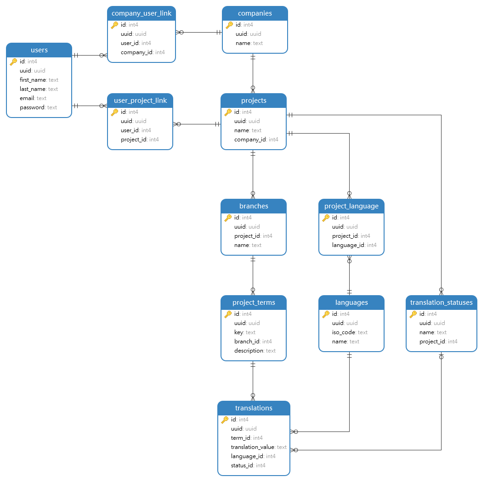

# Database

The database is Postgres with GraphQL on top. 



## Setup

* Install docker

* Start the docker instances
    ```
    npm run start
    ```

* Seed the database
    * If you only want the list with languages to be filled run:
    ```
    npm run seed-database-production
    ```
  
    * If you also want test data. eg: company, projects, branches, translations, run:
    ```
    npm run seed-database-development
    ```

## Development

You can manage the database using the hasura console UI:
```
npm run hasura-open-console
```
The console should automatically open in the browser:
```
http://localhost:8080
```

The typescript types for use in the frontend are automatically generated using:
```
npm run generate-database-types
```
